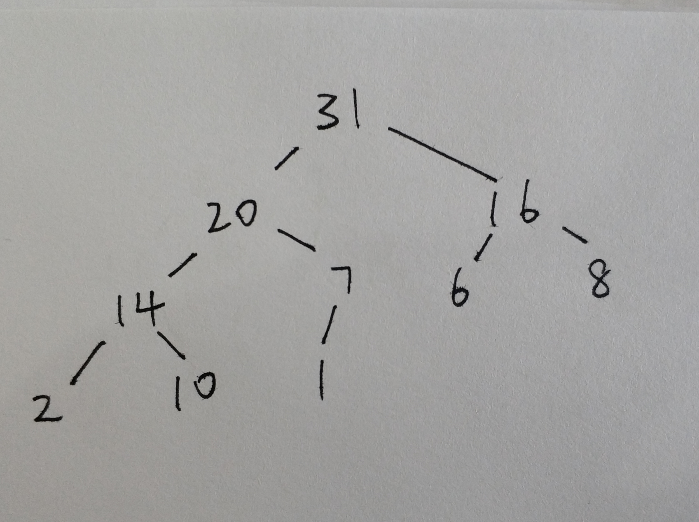

## 1009 黄俊琅

## 简答题

## 分苹果

一共 2000 个苹果，有任意多个箱子用来装苹果，要求一个或多个箱子中的苹果数量之和可以得到 1 到 2000 中的任意数目的苹果。

请问最少需要多少个箱子才能满足上述条件？

答：最少需要 10 个箱子。第一个箱子放 1 个苹果，第二个箱子放 2 个苹果，第三个箱子放 4 个苹果，第四个箱子放 8 个苹果，第五个箱子放 16 个苹果，第六个箱子放 32 个苹果，第七个箱子放 64 个苹果，第八个箱子放 128 个苹果，第九个箱子放 256 个苹果，第十个箱子放 512 个苹果，第十一个箱子放 977 个苹果。

## 地址问题

某计算机内存为 64MB, 字长为 4 字节, 请问其地址总线的取值范围

答：地址总线的取值范围是 0000000H-7FFFFFFH。

# 下面代码段的输出是什么, 并给出解释

    let p = [];
    let s = "string";
    let i;
    for (i = 0; i < s.length; i++)
         p[i] = s[s.length - i];
    console.log(p.join(""));

- a) gnirts
- b) gnirt
- c) string
- d) 没有输出

答：b) gnirt。for 循环里 s[s.length - i]是把字符串 s 从后往前遍历并赋值给 p[i]，遍历的终点是 i=s.length-1，即顺数的第二个字符"t"，所以最终的输出是"gnirt"。

# 下面程序段输出什么, 并给出解释

    let n = 0, m = 0;
    if (n > 0) {
        if (m > 0) {
    	console.log("True");
        }
        else {
    	console.log("False");
        }
    }

- a) True
- b) False
- c) 没有输出
- d) 运行错误

答：c) 没有输出。因为 n=0，所以 if(n>0)中的条件不成立，if 里的代码不执行。

# 二叉树如下,使用先序遍历的结果是:

E. 6 17 9 4 22 16 12

# 二叉搜索树如下, 请问以何种顺序输入无法构造这样的二叉树

E. 5 9 3 6 7 8 4 12 20

# 将如下输入转换为最大堆

    {1, 2, 8, 10, 20, 6, 16, 14, 31, 7}

**提示**: 结果应当是唯一的; 你可以使用数组或是画图作为答案.

答：


# 将如下输入转换为最小堆

    {1, 2, 8, 10, 20, 6, 16, 14, 31, 7}

**提示**: 结果应当是唯一的; 你可以使用数组或是画图作为答案.

答：


# 使用直线划分空间

如下图所示:

- 0 根直线可以划分出 1 个空间
- 1 根直线可以划分出 2 个空间
- 2 根直线可以划分出 4 个空间

**问题**:

1.  写出公式 L(n); n 表示折线数量, L(n)表示通过 n 根折线可以划分出的最多的空间数量

```
L(n)=n*(n+1)/2+1
```

2.  使用 js 语言实现计算 L(n)的函数

```JavaScript
        function calc_line_spaces(n){
            return (n*(n+1)/2+1);
        }; // n >= 0
```

# 使用折线划分空间

如下图所示:

- 0 根折线可以划分出 1 个空间
- 1 根折线线可以划分出 2 个空间
- 2 根折线最多可以划分出 7 个空间

**问题**:

1.  写出公式 Z(n); n 表示折线数量, Z(n)表示通过 n 根折线可以划分出的最多的空间数量

    ```
    Z(n) = 2*n*n-n+1
    ```

2.  使用 js 语言实现计算 Z(n)的函数

```JavaScript
        function calc_zig_spaces(n){
            return (2*n*n-n+1);
        };
```

# 打印三角形

观察上图三角形的规律,实现函数根据输入 n 打印 n 行如图所示三角形.

```JavaScript
fuction draw(n){
    let a = new Array();
    let i,j,k;

    a[0] = new Array();
    a[0][0]=1;

    //构造二维数组，根据上一行计算这一行
    for(i = 1; i < n; i++){
        a[i] = new Array();
        a[i][0]=i+1;
        for(j = 1; j < i; j++) a[i][j] = a[i-1][j-1]+a[i-1][j];
        a[i][j] = i+1;
    }
    //先打印空格再打印数字
    let s =""
    for(i = 0; i < n; i++){
        j = n-i;
        for(k = 1;k <= j;k++) s += " ";
        for(j = 0; j <= i; j++) s += a[i][j] + " ";
        console.log(s);
        s = "";
    }
};
```

# 实现 atof 函数

- 函数定义

      function my_atof(str);

- 函数描述

  `my_atof()` 会扫描参数 str 字符串，跳过前面的空格字符，直到遇上数字或 `.` 符号才开始做转换，而遇到非数字或字符串结束时才结束转换，并将结果返回。

  以下都是合法输入:

      0.123z
      .123k
      16.4cc
      16.
      0.0
      0.

      注意:
        1. 不考虑 +- 符号, 不考虑输入非法的情况
        2. 使用Number()构造函数无法实现这个功能
           例如: Number(".32b")
      	   NaN

```JavaScript
function my_atof(str){
    let r = "";
    for(let i = 0; i < str.length; i++){
        let j = str.charCodeAt(i);
        //根据ascii码判断
        if((j >=48 && j <=57) || j==46){
            r += str[i];
        }else{
            if(r.length != 0) break;
        }
    }
    return r;
}
```

# 使用栈的数据结构实现队列的功能

js 的数组已经提供了 push 和 pop 的方法, 也提供了 length 属性.

请使用已有的栈的方法(push, pop)和属性(length)实现一个队列的功能:

要求: 只能使用 push 和 pop 以及 length, 不能使用其他方法和属性.

请补全下列代码, 要求运行后能输出从 1 到 9

```JavaScript
    class Queue{
        constructor() {
    	this.data = [];
    	this.length = 0;
        }

        enqueue(item) {
            this.data.push(item);
            this.length++;
    	// your code
        }

        dequeue() {
            //出队时先构造另一个栈，把原来的栈翻过去，出队后再翻回来
            let b = new Array;
            for(let i = 0; i < this.length; i++) b.push(this.data.pop());
            let item = b.pop();
            this.length--;
            for(let i = 0; i < this.length; i++) this.data.push(b.pop());
            return item;
    	// your code
        }

        isEmpty() {
            return this.length == 0;
    	// your code
        }
    }

    let q = new Queue();
    for(let i = 1; i < 10; i++) {
        q.enqueue(i);
    }

    while(!isEmpty(q)) {
        console.log(q.dequeue());
    }
```

# 彩票生成器

`从红色球号码（1-33）中选择6个号码，从蓝色球号码（1-16）中选择1个号码，组合为一注号码。`

请你根据上述规则实现程序, 生成一个彩票的号码.

```JavaScript
let red = new Array;
let s = new Array;
let i,j;

for(i = 0; i < 33; i++) red[i] = i+1;
for(i = 0; i < 6;i++){
    j = Math.ceil(Math.random()*(33-i));
    s[i] = red[j];
    for(let k = j; k < red.length; k++) red[k] = red[k+1];
    red.length--;
}
s[i] = Math.ceil(Math.random()*16);

console.log(s);
```
