&nbsp;
## **CSS的学习**
### **1、CSS的基本样式**
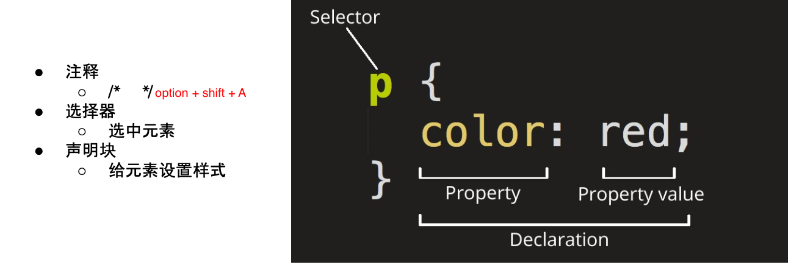

 
### **2、常用选择器**

### **3、其他选择器**
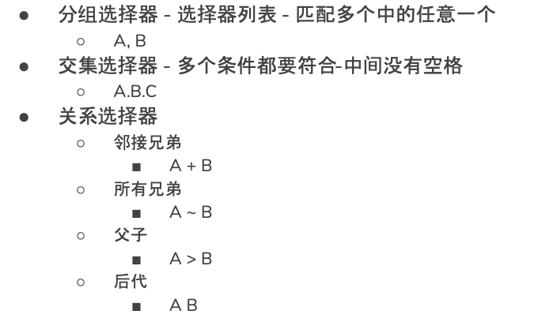

### **4、伪类选择器**

#### **4.1 first-child 、last-child和nth-child()的作用:所有该类型的父类中的同类型的第几个子元素**
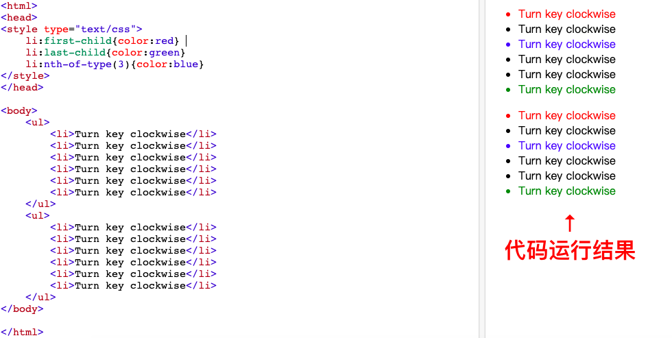 
#### **4.2 first-of-type 、 last-of-type和nth-of-type()的作用：所有该类型的第几个元素**
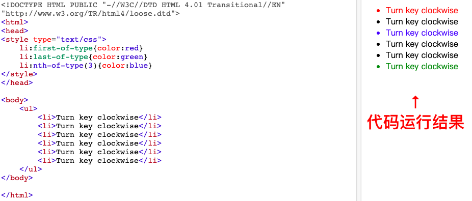
#### **4.3 超链接相关的伪类选择器**
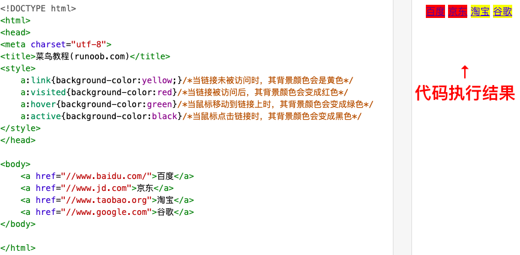

### **5、选择器的优先级和权重**
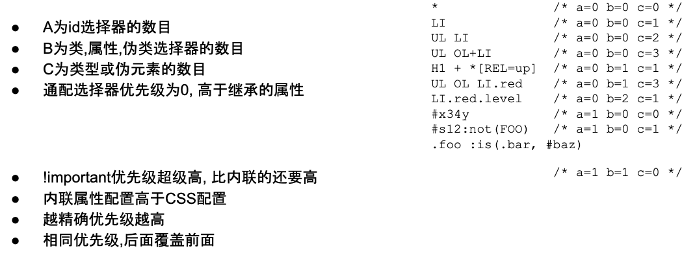

### **6、像素和百分比**
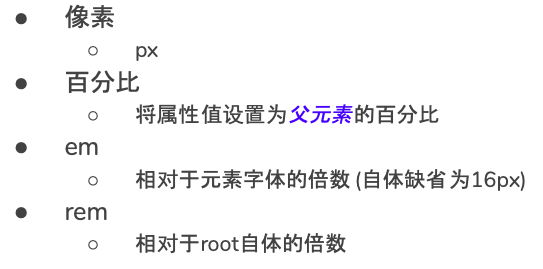

### **7、块元素水平方向的布局**
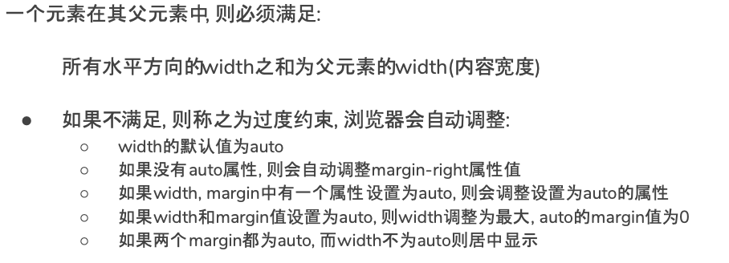

### **8、块元素垂直方向的布局**

### **9、块元素垂直方向的折叠**
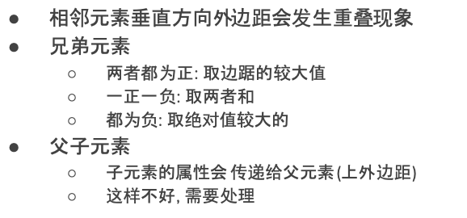

### **10、行内元素的盒子模型**
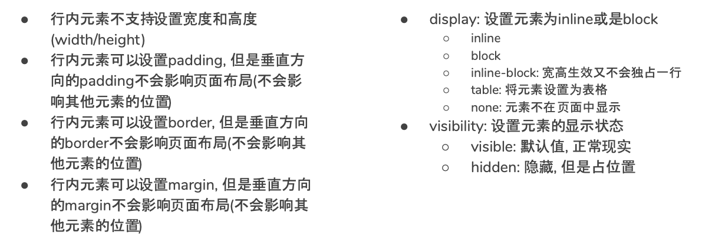

### **11、轮廓阴影和圆角**
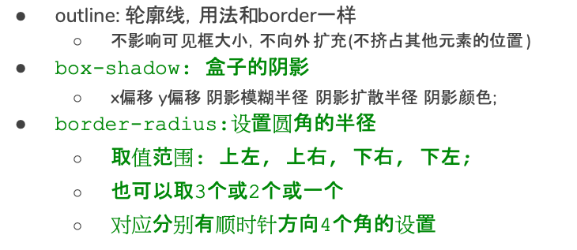

### **12、盒子的尺寸**

## **CSS**

### **1、浮动**

&nbsp;

### **2、浮动的特点**

&nbsp;

### **3、高度塌陷及解决办法**
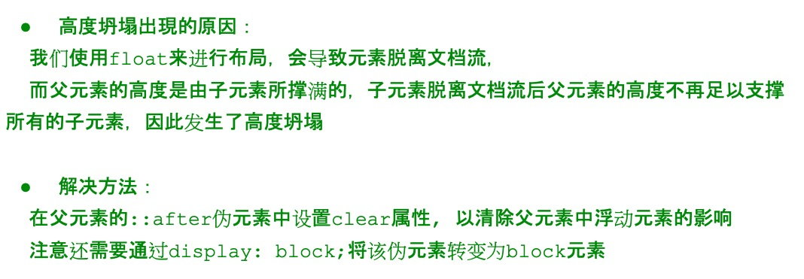

&nbsp;

### **4、定位**

&nbsp;

### **5、固定定位**

&nbsp;

### **6、元素的层级**

&nbsp;

### **7、过渡**
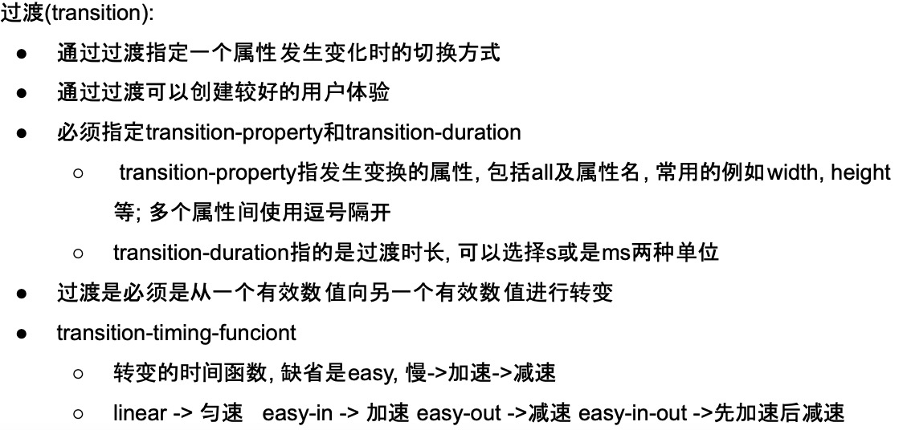 