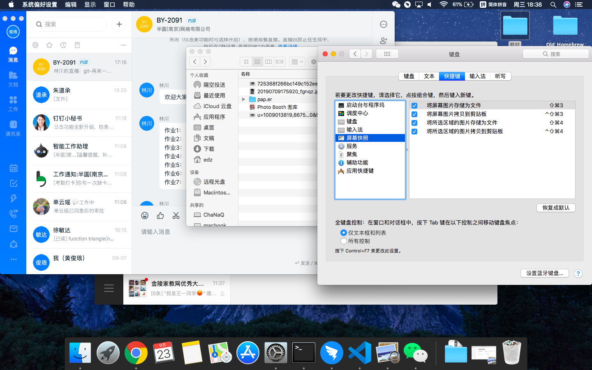

## MarkDown笔记

“#”表示的是：一级标题。  
“##”表示的是：二级标题。  
"*内容*"表示的是：将其内容变成斜体
“**内容**” 表示的是：将其内容加粗显示
"换行操作"：在一句话后面加上两个空格键，再使用Enter即可换行。
“```编程语言”表示的是：以下代码使用什么语言显示
``` c
#include<stdio.h>
void mian(){
    printf("Hello,world")
}
```
---
&nbsp;
### MarkDown的表格操作：
| 姓名 | 年龄 | 性别 |
| - | - | - |
| 张三 | 20 | 男 |
| 李四 | 23 | 女 |

---

### MarkDown插入图片
打字截图:  


---
&nbsp;  
&nbsp;


### 如何打开vim
    在终端输入vi，即可打开编辑器。  
    打开vi编辑器之后  
    按“esc”+“：”+q 表示退出当前编辑器。  
    按“esc”+":"+"wq" 表示保存并退出。

---  
&nbsp;