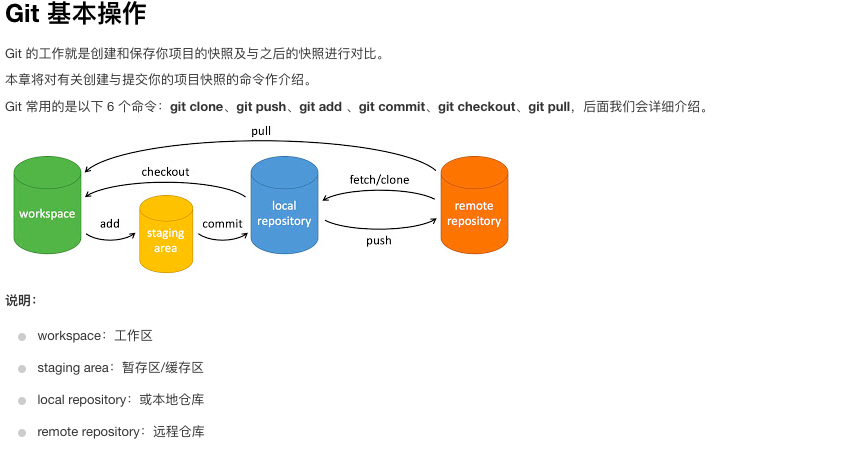

### **git 的基本操作**



### git 的实践命令

**_"git fetch"_** 表示的是：拉取远端的分支，但是不改变你的工作区域。  
**_“git pull”_** 表示的是：当你需要 push 本地到远端时，为了确保本地分支是最新的版本，需要先使用 git pull 这条命令直接将远端的内容拉取到本地的工作区。

**_创建本地新分支_**  
&emsp;&emsp;git checkout -b 新分支的名字  
**_创建远端新分支（前提：本地的分支已经做好了推送到远端的准备）_**  
&emsp;&emsp;git push -u origin 远端分支的名字  
**_查看所有分支_**  
&emsp;&emsp;git branch -a  
**_本地切换分支_**  
&emsp;&emsp;git checkout 分支的名字  
**_创建本地分支并关联远端的一个分支_**  
&emsp;&emsp;git checkout -b 本地分支的名字 origin/远端分支的名字  
**_查看本地分支和远端分支的对应关系_**  
&emsp;&emsp;git branch -vv  
**_删除本地分支_**  
&emsp;&emsp; git branch -D 本地分支名字

---

&nbsp;

### git 的实践操作步骤：

    1、先将远端仓库克隆到自己本地电脑指定的目录下：
        git clone <远端仓库链接地址>
    2、切换到各自的分支上（left/right）
        git checkout -b 文件夹名称 origin/文件夹名称
    3、在这个分支上创建一个目录
        left或right
    4、git push

### 注：

       在.gitignore文件中加入不想被git操作的文件名，即可被git忽略其存在。那么下次上传到远端仓库的时候就不会将其进行上传。
       强制删除：rm -rf 文件夹名称
       当远端的仓库被删除的时候，如果仅仅使用git fetch时，使用命令：git branch -a还是可以看到自己已经被删除的远端分支。那么此时就应该使用：git fetch --prune,该命令表示的是把远端已删除的个人工作仓库同步到本地。

### 合并分支

    git merge origin/要合并的分支名称

### merge 的理解

    "git merge origin/远端分支名称"表示的是：将origin/远端分支 合并到你现在的分支上。

### **注意**

     合并之前需要确保origin/远端分支是最新的版本

### **合并分支到主线分支上的操作步骤**

    1、先选择一个文件夹
        使用“git clone <仓库链接地址>”
    2、创建本地分支：
        git checkout -b 分支名 origin/远端分支名
    3、创建指定分支上的分支：
        git checkout -b 个人本地分支名 origin/远端分支名
    4、将内容添加到个人本地分支上：
        git add .
    5、提交（确保在个人本地分支上）：
        git commit -m "message"
    6、切换到指定的分支上（right）：
        git checkout right
    7、将个人本地分支合并到分支上：
        git merge 个人本地分支名
        (如果你将你本地分支中的内容上传到远端分支中，那么可以使用get merge origin/远端的分支名)
    8、推到远端：
        git push -u origin/right

---

&nbsp;

### **工作流程**

#### 1、clone 整个远端的项目。

    git clone <远端仓库链接地址>

#### 2、创建自己的工作分支。

    1）、基于什么分支来创建你的工作分支
        基于feature分支
        ’git checkout -b 工作分支 origin/feature‘。
        创建出来的新的本地工作分支关联的远端的feature分支。
    2）、是否需要创建远端的个人工作分支？
        （在本地动作分支下）'git push -u orign 个人分支'。

#### 3、工作，提交（commit 到本地工作分支），此时你的工作保存在本地分支上。

#### 4、可选，如果创建了远端的个人工作分支，应该 push 到远端的个人分支。

#### 5、将你的工作合并到 feature 分支。

    注：当执行下列操作之前，要确保使用git checkout 远端分支 。切换到远端的分支上，因为没有切换之前，可能目前所在的分支是自己的工作分支上。
        a)、如果没有创建远端个人分支，则在本地的feature分支上运行 merge (在本地的feature分支下) ’git merge 个人本地分支‘。
        b)、如果创建了远端个人分支，需要保证远端的个人分支是最新的（在本地的feature分支下）’git merge origin/远端个人分支‘。
        在做完 a）或 b）之后，你的本地feature分支上已经有了自己的工作，需要将他push到origin（本地feature分支上）’git push‘。

### **注**

    要删除远端的个人工作分支：
        git push origin --delete 个人工作分支

---

### git 合并分支

现在在 dev 分支上，刚开发完项目，执行了下列命令：

```shell
git add .
git commit -m "备注"
git push -u origin dev
```

想将 dev 分支合并到 master 分支，操作入下：

1.首先切换到 master 分支上

```shell
git checkout master
```

2.如果是多人开发的话，需要把远端 master 上的代码 pull 下来

```shell
git pull origin master
```

3.然后把 dev 分支合并到 master 上

```shell
git merge dev
git push origin master
```
