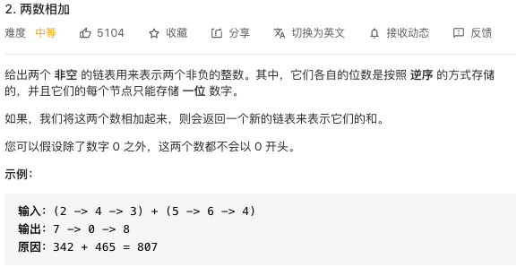

## 力扣练习



我一开始的想法是先把链表变成整数，然后两数相加，然后把和转成新的链表。程序上没问题，但是测试用例中会有一些超长的链表，超出了 double 类型的范围，无法求和，看了题解后重新写了程序。更好的思路是两个链表按位相加，把和作为第三个链表的结点的值，如果产生进位则加到下一结点去，直到遍历完两个链表且没有进位。这样无论两个链表有多长，都可以求和。

```java
package club.banyuan;
public class Main {
    // Definition for singly-linked list.
    public static class ListNode {
        int val;
        ListNode next;
        ListNode() {}
        ListNode(int val) { this.val = val; }
        ListNode(int val, ListNode next) { this.val = val; this.next = next; }
    }

    //打印链表
    public static void print(ListNode l1){
        ListNode l2 = l1;
        while (l2.next != null){
            System.out.print(l2.val+"->");
            l2 = l2.next;
        }
        System.out.println(l2.val);
    }
    //通过数组生成链表
    public static ListNode toListNode(int[] a){
        ListNode l1 = new ListNode(a[a.length-1]);
        for(int i = a.length-2; i >= 0 ;i--){
            ListNode l = new ListNode(a[i],l1);
            l1 = l;
        }
        return l1;

    }

    //题解
    public static ListNode addTwoNumbers(ListNode l1,ListNode l2) {
        ListNode root = new ListNode(0);//链表头
        ListNode cursor = root;//负责向后生成的链表
        int carry = 0;//相加产生的进位；
        while (l1 != null || l2 != null || carry != 0) {//结束的条件是l1走到尾、l2也走到尾、不再产生进位
            int l1Val = l1 != null ? l1.val : 0;//把l1的当前结点的数取出
            int l2Val = l2 != null ? l2.val : 0;//把l2的当前结点的数取出
            int sumVal = l1Val + l2Val + carry;//当前位求和，注意加上上一位的进位carry
            carry = sumVal / 10;//把sumVal超出的进位赋值给carry；

            ListNode sumNode = new ListNode(sumVal % 10);//新结点的数据为sumVal的个位
            cursor.next = sumNode;//把新结点接到链表中
            cursor = sumNode;//继续向后走

            if (l1 != null) l1 = l1.next;//l1、l2也向后走
            if (l2 != null) l2 = l2.next;
        }

        return root.next;
    }

    public static void main(String[] args) {
        int[] list1 = new int[]{9};
        int[] list2 = new int[]{1,9,9,9,9,9,9,9,9,9,9,9,9,9,9,9,9,9,9,9,9,9,9,9,9,9};

        ListNode l1 = toListNode(list1);
        ListNode l2 = toListNode(list2);

        print(l1);
        print(l2);

        ListNode l3 = addTwoNumbers(l2,l1);
        print(l3);

    }
}
```

最终成绩：


