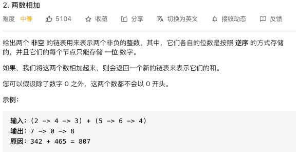
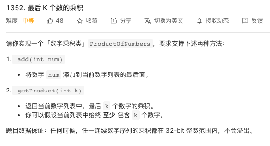
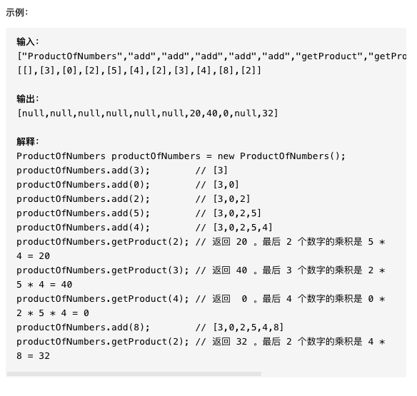
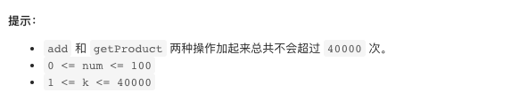
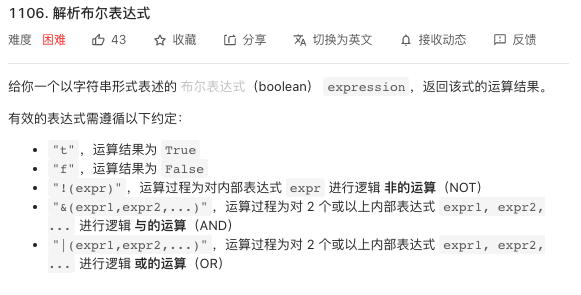
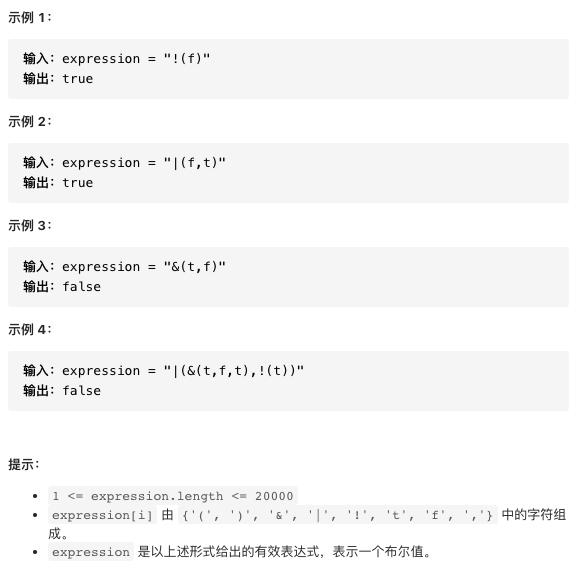

## 力扣练习 1



我一开始的想法是先把链表变成整数，然后两数相加，然后把和转成新的链表。程序上没问题，但是测试用例中会有一些超长的链表，超出了 double 类型的范围，无法求和，看了题解后重新写了程序。更好的思路是两个链表按位相加，把和作为第三个链表的结点的值，如果产生进位则加到下一结点去，直到遍历完两个链表且没有进位。这样无论两个链表有多长，都可以求和。

```java
package club.banyuan;
public class Main {
    // Definition for singly-linked list.
    public static class ListNode {
        int val;
        ListNode next;
        ListNode() {}
        ListNode(int val) { this.val = val; }
        ListNode(int val, ListNode next) { this.val = val; this.next = next; }
    }

    //打印链表
    public static void print(ListNode l1){
        ListNode l2 = l1;
        while (l2.next != null){
            System.out.print(l2.val+"->");
            l2 = l2.next;
        }
        System.out.println(l2.val);
    }
    //通过数组生成链表
    public static ListNode toListNode(int[] a){
        ListNode l1 = new ListNode(a[a.length-1]);
        for(int i = a.length-2; i >= 0 ;i--){
            ListNode l = new ListNode(a[i],l1);
            l1 = l;
        }
        return l1;

    }

    //题解
    public static ListNode addTwoNumbers(ListNode l1,ListNode l2) {
        ListNode root = new ListNode(0);//链表头
        ListNode cursor = root;//负责向后生成的链表
        int carry = 0;//相加产生的进位；
        while (l1 != null || l2 != null || carry != 0) {//结束的条件是l1走到尾、l2也走到尾、不再产生进位
            int l1Val = l1 != null ? l1.val : 0;//把l1的当前结点的数取出
            int l2Val = l2 != null ? l2.val : 0;//把l2的当前结点的数取出
            int sumVal = l1Val + l2Val + carry;//当前位求和，注意加上上一位的进位carry
            carry = sumVal / 10;//把sumVal超出的进位赋值给carry；

            ListNode sumNode = new ListNode(sumVal % 10);//新结点的数据为sumVal的个位
            cursor.next = sumNode;//把新结点接到链表中
            cursor = sumNode;//继续向后走

            if (l1 != null) l1 = l1.next;//l1、l2也向后走
            if (l2 != null) l2 = l2.next;
        }

        return root.next;
    }

    public static void main(String[] args) {
        int[] list1 = new int[]{9};
        int[] list2 = new int[]{1,9,9,9,9,9,9,9,9,9,9,9,9,9,9,9,9,9,9,9,9,9,9,9,9,9};

        ListNode l1 = toListNode(list1);
        ListNode l2 = toListNode(list2);

        print(l1);
        print(l2);

        ListNode l3 = addTwoNumbers(l2,l1);
        print(l3);

    }
}
```

最终成绩：


## 力扣练习 2







写一个数组存数字，因为提示已经说了不会超过 40000，所以数组的大小就是 40000，再写一个 n 表示当前的数量。加入就直接加，k 位相乘时就通过循环进行相乘。

```java
package club.banyuan;

public class Test1 {
    static class ProductOfNumbers {
        int num[] = new int[40000];
        int n = 0;

        public ProductOfNumbers() {

        }

        public void add(int num) {
            this.num[this.n++] = num;
        }

        public int getProduct(int k) {
            int sum = this.num[this.n-1];
            int b = this.n-2;
            for(int i = 0;i < k-1;i++){
                sum *= this.num[b];
                b--;
            }
            return sum;
        }

        public void get(){
            System.out.print("[");
            for(int i = 0;i < n;i++){
                System.out.print(this.num[i]+",");
            }
            System.out.println("]");
        }
    }

    public static void main(String[] args) {
        ProductOfNumbers productOfNumbers = new ProductOfNumbers();

        productOfNumbers.add(3);        // [3]
        productOfNumbers.add(0);        // [3,0]
        productOfNumbers.add(2);        // [3,0,2]
        productOfNumbers.add(5);        // [3,0,2,5]
        productOfNumbers.add(4);        // [3,0,2,5,4]

        productOfNumbers.get();
        System.out.println(productOfNumbers.getProduct(0));

    }
}
```

最终成绩：


## 力扣练习3





遇到这种括号和符号判断的，用栈来写，遇到‘)'就出栈，判断，返回新的t or f；没遇到就入栈，看完思路还是挺清晰的，但自己来写还是有难度。

```java
public class Solution {
    public boolean parseBoolExpr(String expression) {
        Stack<Character> op = new Stack<>();//新建一个栈
        String temp = "";//当前字符串
        for(int i = 0; i < expression.length(); i++){//遍历整字符串
            char c = expression.charAt(i);//.char是字符串中的一个方法，获取位置i的字符
            if(c == ')'){//当遇到')'，就向前找'('
                while(op.peek() != '('){
                    temp = op.pop() + temp;
                }//找到'('
                op.pop();//将'('弹出
                char operation = op.pop();//获取'('前当符号，即判断符
                op.push(isBool(temp, operation));//此时temp就是中间当字段，operation是判断符，传入isBool进行判断，返回t or f
                temp = "";//置空准备下一次
            } else if(c != ','){
                op.push(c);//没有遇到')'时，将字符入栈
            }
        }
        if(op.peek() == 't'){//最终栈内只剩下一个结果
            return true;
        }
        return false;
    }

    //传入op为判断符号，判断传入字符串s，返回字符结果
    public char isBool(String s, char op){
        if(op == '!'){
            if(s.equals("f")){
                //equals() 方法用于将字符串与指定的对象比较，相等返回ture。
                return 't';
                //"!"取反
            }else{
                return 'f';
            }
        }else if(op == '|'){
            if(s.indexOf('t') != -1){
                // indexOf(int ch)，返回指定字符在字符串中第一次出现处的索引，如果此字符串中没有这样的字符，则返回 -1。
                //对于"|"或运算,只要有一个t，则返回t
                return 't';
            }else{
                return 'f';//没有t（全为f），返回f
            }
        }else if(op == '&'){
            if(s.indexOf('f') != -1){
                //对于"&"与运算，只要有一个f，则返回f
                return 'f';
            }else{
                return 't';//没有f（全为t），返回t
            }
        }
        return 'f';//根据java语法，必须保证要有return，所以在此补一个return，t or f不重要
    }
}

```

最终结果：


