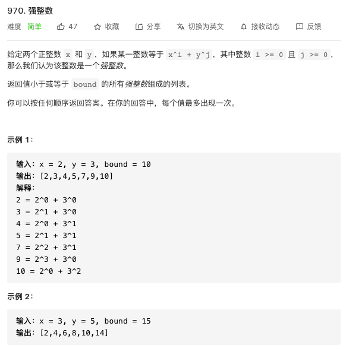
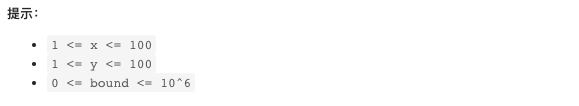

## 力扣练习1





一开始我想写两个循环，i和j循环计算x和y的幂，直到大于bound，但是当x和y，bound变大之后，运行时间就会特别长。参考评论区写的。既然是x，y的幂，且不需要具体的i和j的值，可以直接让i个x和j个y相乘，然后求和，只要和不大于bound，都是符合条件的。


```java
class Solution {
    public List<Integer> powerfulIntegers(int x, int y, int bound) {
        Set<Integer> set = new HashSet<>();
        
        for (int a = 1; a < bound; a *= x) {//a是x的连乘，判断条件是小于bound
            for (int b = 1; a + b <= bound; b *= y) {//b是y的连乘，判断条件好似bound
                set.add(a + b);//把幂之和加入列表；
                if (y == 1) break;//如果y是1就没必要乘了
            }
            if (x == 1) break;//如果x是1就没必要乘了
        }
        
        return new ArrayList<>(set);

    }
}
```


## 力扣练习2


其实我还没弄懂这个具体懂加密算法，但是评论区都用这个方法，那我也整一个

```java
public class Codec {

    // Encodes a URL to a shortened URL.
    public String encode(String longUrl) {
        return longUrl;
        
    }

    // Decodes a shortened URL to its original URL.
    public String decode(String shortUrl) {
        return shortUrl;
    }
}

// Your Codec object will be instantiated and called as such:
// Codec codec = new Codec();
// codec.decode(codec.encode(url));
```

赏心悦目都成绩；

