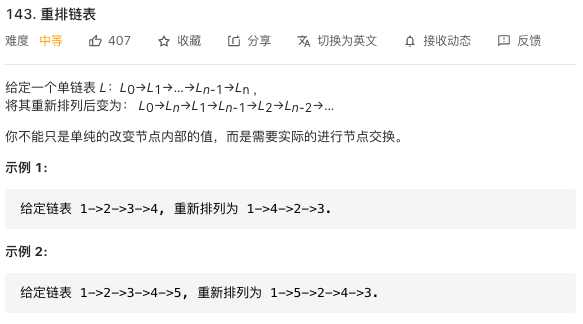

# 继承和多态

1. extends
2. 复制父类的所有可以访问的属性和方法，包括静态的。
3. 子类的构造方法必须要调用父类的构造方法
4. super关键字 当前子类对象的父对象
super可以调用父类的某个构造器
super.属性 super.方法 调用父类的属性和方法
5. 单继承，一个类只能继承一个类

## 多态
1. 继承关系
2. 方法的重写
子类的方法访问修饰符一定要大于等于父类的方法
3. 父类的引用指向子类的对象
编译时 father.method();
运行时 son method();

强转(Male)female ClassCastException
instanceof关键字

## final
1. 修饰一个class，不能被继承
2. 修饰一个变量，变成一个常量//常量一般全大写
3. 修饰一个方法，不能被重写

## 抽象类 abstract 
1. 不能被实例化的类
2. 里面可以有抽象方法
a. 也可以没有
b. 实现类不可以有抽象类

## 总结调用的顺序

1. 父类静态代码块
2. 子类静态代码块
3. 父类普通代码块
4. 父类构造方法
5. 子类普通代码块
6. 子类构造方法

## 其他
 
 ```
 int a = 1;
 a = a++;
 System.out.println(a);//输出1
 ```

  ```
 int a = 1;
 a = ++a;
 System.out.println(a);//输出2
 ```

a++，是首先保存a原来的值，然后对a进行加1。然后返回保存的那个值。也就是说当a++执行完毕以后，a的值确实加了一。（1+1）应该是2，为什么输出会是1呢？因为a++执行以后，返回的是a加1之前的值，而这个返回值又被赋给了a，所以a又变回了原来的那个a，就是1。

那么a到底有没有加1？确实加了1，有那么一段时间它是2，但是，一旦a++执行完毕，返回以后，a马上被赋予原来的值，又从2变回了1。

## 力扣题目1



一开始的思路比较简单，就是写一个seek函数用来查找第i个结点，然后一个一个结点更换，方法没错，但是时间复杂度太高，因为几乎每次都要遍历一遍链表，但得益于只在一条链表上操作，空间复杂度较小。

```java
package club.banyuan;

class ListNode {
      int val;
      ListNode next;
      ListNode() {}
      ListNode(int val) { this.val = val; }
      ListNode(int val, ListNode next) { this.val = val; this.next = next; }
  }

public class Main {
    static void print(ListNode head){
        while (head.next != null){
            System.out.print(head.val + "->");
            head = head.next;
        }
        System.out.println(head.val);
    }

    static ListNode seek(ListNode l, int n){
        ListNode l1 = l;
        for(int i = 0;i < n - 1 ;i++){
            l1 = l1.next;
        }
        return l1;
    }

    static void reorderList(ListNode head) {
       int n=0;
       ListNode h = head;
       while (h!=null) {
           h = h.next;
           n++;
       }
       if(n > 1) {
           ListNode l1 = head;
           ListNode l2 = head.next;
           while (l2.next != null) {
               ListNode ln = seek(head, n);//每次都需要查找
               l1.next = ln;
               ln.next = l2;
               l1 = l2;
               l2 = l2.next;
               seek(head, n).next = null;
           }
       }
    }

public static void main(String[] args) {
	// write your code here

        int[] l = new int[]{1,2,3,4,5,6,7};
        ListNode l1 = new ListNode(l[0]);
        ListNode l2 = l1;
        for(int i = 1;i<l.length;i++){
            ListNode a = new ListNode(l[i]);
            l2.next = a;
            l2 = a;
        }
        print(l1);
        reorderList(l1);
        print(l1);


    }
}

```


这是评论区都一个方法，先把链表从中拆成两段，把后面一段翻转，再插入到前一段中，思路也比较清晰，且时间复杂度和空间复杂度都比较小，还是要学习一个☝️

```java
static void reorderList(ListNode head) {
        if (head == null)
            return;
        int len = 0;      //记录链表长度
        ListNode p = head, q = head;
        while (p != null) {
            len++;
            p = p.next;
        }
        int af = len / 2;
        p = head;
        while (af > 0) {
            q = q.next;
            af--;
        }
        while (q.next != null) {
            q = q.next;
            p = p.next;
        }       //结束后，p为第一段链表最后一个节点
        ListNode cur = p.next;
        p.next = null;      //一定要把next设为null，将两段隔离开
        ListNode temp, k = null;
        while (cur != null) {     //第二段链表反转
            temp = cur.next;
            cur.next = k;
            k = cur;
            cur = temp;
        }
        p = head;
        cur = k;
        ListNode temp1, temp2;
        while (cur != null) {   //插入
            temp1 = p.next;
            temp2 = cur.next;
            p.next = cur;
            cur.next = temp1;
            cur = temp2;
            p = temp1;
        }
    }
```


