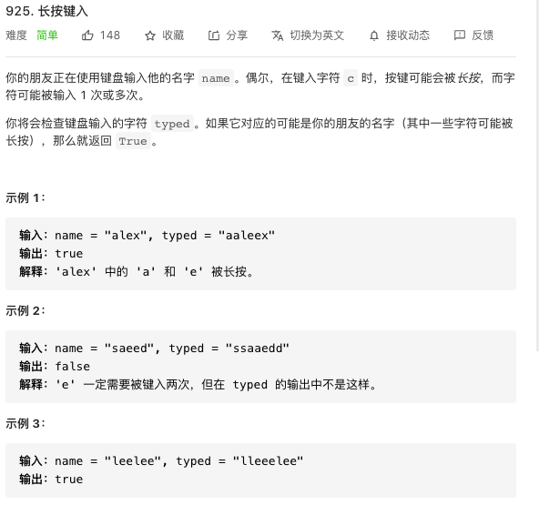
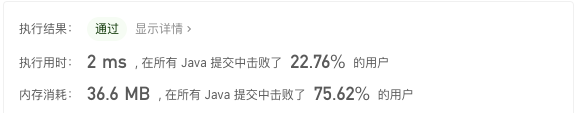

## 力扣练习



两个指针，判断对应字符是否相等，不同情况下不同指针向前走，j 超过 i 或者走到头结束，中间出现不符合题目规定的情况也结束并返回 false。

```java
package club.banyuan;

public class Main {
    public static boolean isLongPressedName(String name, String typed) {
        boolean is = true;
        for (int i = 0, j = 0; i < name.length() && j < typed.length(); ) {
            //如果i和j相等且没有走到头
            if (name.charAt(i) == typed.charAt(j) && i != name.length() - 1 && j != typed.length() - 1) {
                //如果i和j都等于下一个字符，就同时走一步
                if (typed.charAt(j) == typed.charAt(j + 1) && name.charAt(i) == name.charAt(i + 1)) {
                    j++;
                    i++;
                } else {//如果i和j都不等于下一个，就同时走一步
                    if (typed.charAt(j) != typed.charAt(j + 1)) {
                        i++;
                    }//如果只有j等于下一个，就只有j走一步
                    j++;
                }
            } else {//如果走到头且相等
                if (name.charAt(i) == typed.charAt(j)) {
                    if (i == name.length() - 1) {
                        j++;//如果i走到头则j继续走
                    } else {//如果j先走到头则为false
                        is = false;
                        break;
                    }
                } else {//如果走到头且不相等则为false
                    is = false;
                    break;
                }
            }
        }
        return is;
    }


        public static void main(String[] args) {
        String name = "saeede";
        String typed = "saeede";
        System.out.println(isLongPressedName(name,typed));
    }
}
```


