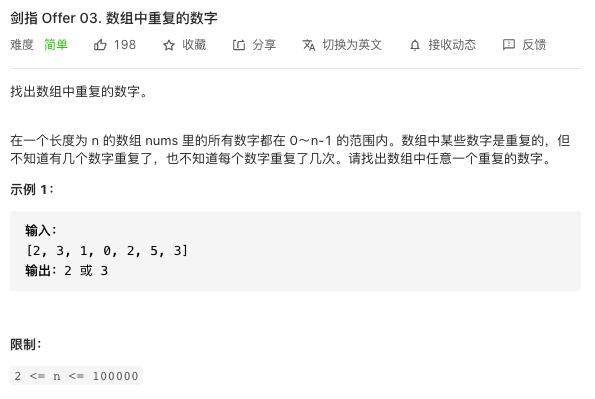
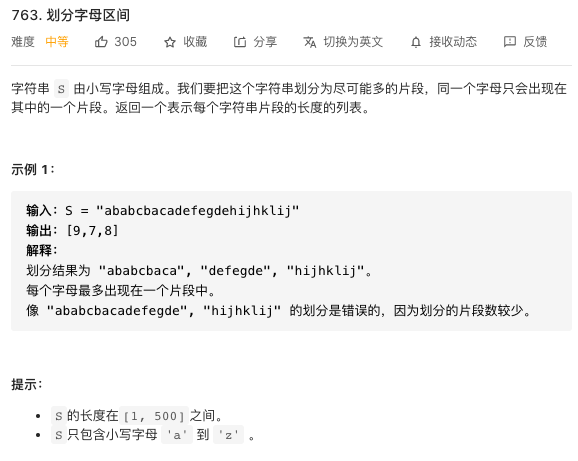
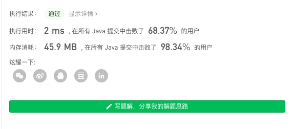

## Integer 类

```java
    Integer a1 = new Integer(100);//11中已经过时类，不建议用
    Integer a2 =  Integer.valueOf(100);//可以这样写

```

## 力扣练习 1



感觉挺简单的一道题，一看题解吓一跳。这题的思想是哈希表，或者说桶。注意题目的条件，数组里的数是不会大于数组的长度。就可以新建一个数组，把原数组里的数放进它的值的位置，如果有重复，就结束。这样的时间复杂度为O(n)，最多循环一次。更好的方法是直接在原数组交换数的它的值的位置，如果重复，则结束。这样空间复杂度为O(1)。

```java
class Solution {
    public int findRepeatNumber(int[] nums) {
        int[] nums2 = new int[nums.length];
        for(int i = 0 ; i < nums.length; i++){
        if(nums2[nums[i]] > 0){
            return nums[i];
            }else{
                nums2[nums[i]] += 1;
            }
        }
        return -1;
    }
}
```


## 力扣练习2



记录每一个字母的开头和结尾，存在二维数组中。然后寻找每个字母最后出现的位置是不是当前字段的最大值，如果是则分割，下一个字母继续寻找。总的来说算是一种贪心算法。但是我会的方法不多，写得比较繁琐，但最后还是通过了。后面还贴了一个写得比较好的。

```java
package Likou_763;
import java.util.ArrayList;

class Solution {
    public static ArrayList powerfulIntegers(String s) {
        ArrayList<Integer> a= new ArrayList<>();
        char[] c = new char[26];
        int[][] range = new int[27][2];
        int number = 0;
        for(int i = 0,j;i < s.length();i++){
            for (j = 0;j < number;j++){
                if(s.charAt(i) == c[j]){
                    range[j][1] = i;
                    break;
                }
            }
            if( j == number){
                c[number] = s.charAt(i);
                range[number][0] = i;
                range[number][1] = i;
                number++;
            }
        }

        int max = range[0][1];
        int[] t = new int[26];
        int k = 0;
        for(int i = 0;i< number;i++){
            if(range[i][0] > max){
                t[k++] = range[i][0];
                max = range[i][1];
            }else {
                if(range[i][1] > max){
                    max = range[i][1];
                }
            }
        }
        if(range[number][0] < max){
            t[k] = max+1;
        }
        a.add(t[0]);
        for(int i = 1;i <= k;i++){
            a.add(t[i] - t[i-1]);
        }
        return a;
    }
    public static void main(String[] args) {
        // write your code here
        String  s = "ababcbacadefegdehijhklij";
        ArrayList a = powerfulIntegers(s);
        System.out.println(a);
    }
}
```



评论区的一个写法：
遍历字符串 找到和起点相同的最后一个字母 查看此区间里的字母最后的index是否超出区间 超出则更新区间 直至找到最大的index 则index - i + 1就是所求区间长度 使用cache来存储每个字母的最后出现位置

```java
 public List<Integer> partitionLabels(String S) {
        if (S == null || S.length() == 0) {
            return null;
        }

        List<Integer> res = new ArrayList<>();
        int index, i, len = S.length();
        int[] cache = new int[26];
        for (i = 0; i < len; i++) {
            cache[S.charAt(i) - 'a'] = i;
        }
        i = 0;
        while (i < len) {
            index = cache[S.charAt(i) - 'a'];
            for (int j = i + 1; j < index && j < len; j++) {
                if (cache[S.charAt(j) - 'a'] > index) {
                    index = cache[S.charAt(j) - 'a'];
                }
            }
            res.add(index - i + 1);
            i = index + 1;
        }
        return res;

    }
```