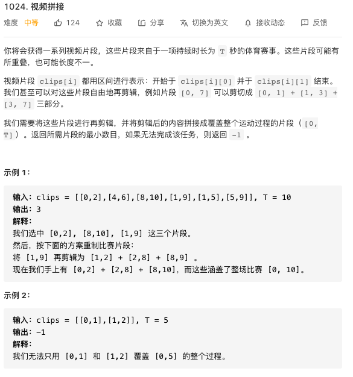

## 数组排序
arr是基本的数据类型数组，Arrays.sort会进行升序排列：

    Arrays.sort(arr);

对于自定义的类的对象数组排序，需要比较器Comparator 
```java
    Arrays.sort(arr,(x,y)->{return y.getName().compareTo(x.getName());});
    //比较对象x与y的大小，这里的x和y对象是比较他们的Name字符，x大于、等于、小于y分别返回负数、0、正数
```
arr是需要排序的数组，后面是一个comparato对象，写法相当于下面：
```java
Arrays.sort(arr, new Comparator<Student>() {
            @Override
            public int compare(Student o1, Student o2) {
                return o1.getName().compareTo(o2.getName());
            }
        });
```
另一个例子：
```java
int[][] clips = new int[][]{{0,2},{4,6},{8,10},{1,9},{1,5},{5,9}};
System.out.println(Arrays.deepToString(clips));//输出二维数组的一种方法
Arrays.sort(clips, (a, b) -> a[0]-b[0] == 0 ? b[1]-a[1] : a[0]-b[0]);//排序依据，如果头相同就按头来排，如果头不相同就按尾来排
System.out.println(Arrays.deepToString(clips));
```


## 力扣练习



贪心：按照起点升序，起点相同则终点降序
  1. 对于每一个出发点，最远能到达的位置是 maxRight，结束条件为 maxRight >= T
  2. 遍历当前 maxRight 之前的出发点，如果最远到达的超过 maxRight，则更新
  3. 如果遍历完了都没有能超过 maxRight 的，说明不可能到达 T 了，否则结果 +1

```java
package club.banyuan;

import java.util.Arrays;
class Solution {
    public static int  videoStitching(int[][] clips, int T) {
        System.out.println(Arrays.deepToString(clips));
        Arrays.sort(clips, (a, b) -> a[0]-b[0] == 0 ? b[1]-a[1] : a[0]-b[0]);
        //排序依据，如果头相同就按头来排，如果头不相同就按尾来排
        System.out.println(Arrays.deepToString(clips));
        int ans = 0;
        int maxRight = 0;
        while(maxRight < T){
            int temp = maxRight;
            for(int j = 0; j < clips.length && clips[j][0] <= maxRight; j++){
                temp = Math.max(temp, clips[j][1]);
            }
            if(temp == maxRight)return -1;
            maxRight = temp;
            ans++;
        }
        return ans;
    }


    public static void main(String[] args) {
        int[][] clips = new int[][]{{0,2},{4,6},{8,10},{1,9},{1,5},{5,9}};
        int T = 10;
        System.out.println(videoStitching(clips,T));
    }
}
```
