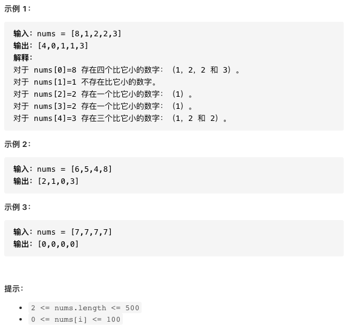
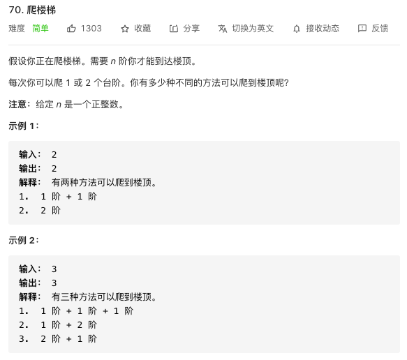

## 异常处理

错误  
运行时的错误  

    String s = null;
    s.substring(1);

异常来抛出

Throwable
Error 系统级的致命的重量级的错误
Exception 轻量级的错误
RuntimeException 运行时异常 未检查的异常
其他的异常 非运行异常 已检查的异常

编译器强迫你去处理
1. 消极处理 throws
2. 积极处理 try-catch

throw：
作用在方法内，表示抛出具体异常，由方法体内的语句处理。具体向外抛出的动作，所以它抛出的是一个异常实体类。若执行了Throw一定是抛出了某种异常。

throws：
作用在方法的声明上，表示如果抛出异常，则由该方法的调用者来进行异常处理。主要的声明这个方法会抛出会抛出某种类型的异常，让它的使用者知道捕获异常的类型。出现异常是一种可能性，但不一定会发生异常。


## 力扣练习1




这个问题直接写个嵌套的for循环就太简单了，时间复杂度是O(n^2)，其实以前做过类似的，但可能做的还不够多，一时没想起来，就是用桶的思想。

```java
public class test1 {
    public static void main(String[] args) {
        int[] nums = new int[]{8,1,2,2,3};
        int[] nums1 = ints(nums);
        System.out.println(Arrays.toString(nums1));
    }

    static int[] ints(int[] nums){
        //因为题目说明了最大的数为100，所以只需造101就可以放下所有的数
        int[] arrays = new int[101];
        //统计各个数字出现的次数
        for (int num : nums) arrays[num]++;
        //从1开始（已知0是最小的就跳过了），把前一个数出现的次数加上自己的，就是比下一个数小的数的个数
        for (int i = 1; i < arrays.length; i++) arrays[i] += arrays[i - 1];
        //把桶里的数据放回到原数组里，节省空间。比0小的数只有0个
        for (int i = 0; i < nums.length; i++) nums[i] = nums[i] != 0 ? arrays[nums[i] - 1] : 0;
        return nums;
    }

}
```


## 力扣练习2-动态规划问题



方法一：动态规划
思路和算法

我们用 f(x)f(x) 表示爬到第 xx 级台阶的方案数，考虑最后一步可能跨了一级台阶，也可能跨了两级台阶，所以我们可以列出如下式子：

f(x) = f(x - 1) + f(x - 2)
f(x)=f(x−1)+f(x−2)

它意味着爬到第 xx 级台阶的方案数是爬到第 x - 1x−1 级台阶的方案数和爬到第 x - 2x−2 级台阶的方案数的和。很好理解，因为每次只能爬 11 级或 22 级，所以 f(x)f(x) 只能从 f(x - 1)f(x−1) 和 f(x - 2)f(x−2) 转移过来，而这里要统计方案总数，我们就需要对这两项的贡献求和。

以上是动态规划的转移方程，下面我们来讨论边界条件。我们是从第 00 级开始爬的，所以从第 00 级爬到第 00 级我们可以看作只有一种方案，即 f(0) = 1f(0)=1；从第 00 级到第 11 级也只有一种方案，即爬一级，f(1) = 1f(1)=1。这两个作为边界条件就可以继续向后推导出第 nn 级的正确结果。我们不妨写几项来验证一下，根据转移方程得到 f(2) = 2f(2)=2，f(3) = 3f(3)=3，f(4) = 5f(4)=5......我们把这些情况都枚举出来，发现计算的结果是正确的。

我们不难通过转移方程和边界条件给出一个时间复杂度和空间复杂度都是 O(n)O(n) 的实现，但是由于这里的 f(x)f(x) 只和 f(x - 1)f(x−1) 与 f(x - 2)f(x−2) 有关，所以我们可以用「滚动数组思想」把空间复杂度优化成 O(1)O(1)。下面的代码中给出的就是这种实现。


