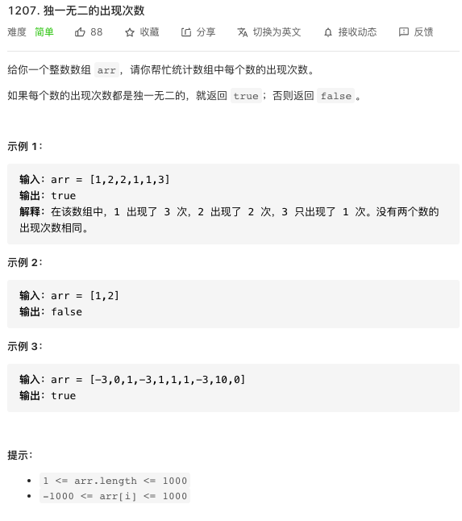

## HashMap

HashMap 是一个散列表，它存储的内容是键值对(key-value)映射。

HashMap 实现了 Map 接口，根据键的 HashCode 值存储数据，具有很快的访问速度，最多允许一条记录的键为 null，不支持线程同步。

HashMap 是无序的，即不会记录插入的顺序。

HashMap 继承于 AbstractMap，实现了 Map、Cloneable、java.io.Serializable 接口。


HashMap 的 key 与 value 类型可以相同也可以不同，也可以用自定义的类型,当你用一个自定义对象作为 key 时，必须添加 equals 和 hashCode，不然不符合唯一性。
HashMap 中的元素实际上是对象，一些常见的基本类型可以使用它的包装类。
基本类型对应的包装类表如下：

| 基本类型 | 引用类型  |
| -------- | --------- |
| boolean  | Boolean   |
| byte     | Byte      |
| short    | Short     |
| int      | Integer   |
| long     | Long      |
| float    | Float     |
| double   | Double    |
| char     | Character |

创建一个 HashMap

    Map<String,Integer> map = new HashMap<>();

一些显示的方法

```java
        //返回所有的key，放到set里
        Set<String> leySet = map.keySet();

        for (String key :
                map.keySet()) {
            System.out.println(key + "="+ map.get(key));
        }
        System.out.println("-------------------");

        //得到所有的value,只有value
        Collection<Integer> c = map.values();
        for (Integer in :
                c) {
            System.out.println(in);
        }
        System.out.println("------------------");

        //单个键值对
        Set<Map.Entry<String,Integer>> entrySet =
                //得到一组键值对
                map.entrySet();
        //得到所有键值对
        for (Map.Entry<String, Integer> entry :
                entrySet) {
            System.out.println(entry.getKey()+"="
                    +entry.getValue());
        }

```

判断是否包含 key 或 value 的方法

```java
        System.out.println(map2.containsKey(new Hero("bbb")));
        System.out.println(map2.containsValue("ccc"));
```

Hashtable 几乎所有的方法都有同步锁（同步锁会影响效率，所以一般都不用 Hashtable，用 Map）
不允许 null 为 key

## TreeMap

## 多线程 高并发

### 力扣练习



今天刚好学到HashMap，今天就用上了，但是评论区有个用得更精彩的，getOrDefault方法，和map的get方法差不多，查找一个key，找不到时get会返回null，getOrDefault会返回输入的默认值Defaultvalue。

```java
public static boolean un(int[] arr){
        //key为元素，value为次数
        Map<Integer, Integer> counter = new HashMap<>();
        for (int elem : arr)
        //把元素，次数加入进去，如果是第一次出现次数就是0+1，不是第一次就是原来的次数+1
            counter.put(elem, counter.getOrDefault(elem, 0) + 1);

        //循环结束后map里存了元素和出现的次数，把次数放进hashset里，如果有重复，长度会变小，和原来的不相等了
        return counter.size() == new HashSet<Integer>(counter.values()).size();
    }
```
