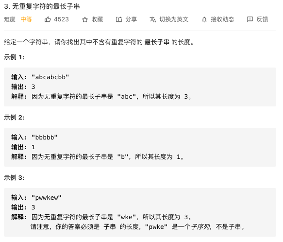

### 顺序表的实现

/Desktop/作业/1028/data/collection

### 单向链表的实现

### 双向链表的实现

### HashMap 的实现

### IO 流

/Desktop/作业/1028/data/IO


InputStream 字节输入流
每次读单个字节
OutputStream 字节输出流
每次写一个字节

Reader 字符输入流
每次读两个字节（一个字符）
Writer 字符输出流
每次写两个字节（一个字符）

基本流
过滤流（高级流）

### 力扣练习 1



定义两个指针，一个左指针，一个右指针，从长串开头，先移动右指针，获取一个字符，如果“窗口”（即两指针间）里没有重复的字符，继续向右移右指针；直到遇上“窗口”中已包含的字符，右指针等待；开始移动左指针，每移动一次，看看现“窗口”中是否还包含右指针所指的字符；直到“窗口”中没有右指针所指字符，就停止移动左指针，接着继续移动右指针。重复以上步骤，直到有一个指针（一般是右指针）移动到长串边界，结束。在这个过程中随时记录“窗口”最大时的情况，即是我们的答案。

```java
class Solution {
    public int lengthOfLongestSubstring(String s) {
        //如果为字符串为空直接返回0，节省时间
        if (s.length() == 0) {
            return 0;
        }
        //利用了哈希表的不可重复性
        Set<Character> set = new HashSet<>();
        int left = 0;
        int right = 0;
        int length = 0;
        //当右指针移动到头的时候就结束循环
        while(right < s.length()) {
            //判断右指针的字符是否在set里
            if(set.contains(s.charAt(right))) {
                //如果是，左指针走一步
                set.remove(s.charAt(left++));
            } else {
                //如果不是，右指针走一步
                set.add(s.charAt(right++));
            }
            //更新字符串长度
            if (set.size() > length) {
                length = set.size();
            }
        }
        return length;
    }
}
```


菜鸡如我终于有道会做的题了。本结点的值乘10加到左右结点上，再递归，把返回的左右结点值相加就是结果了

执行用时：0 ms, 在所有 Java 提交中击败了100.00%的用户

内存消耗：36.1 MB, 在所有 Java 提交中击败了91.85%的用户

```kotlin
class Solution {
    public int sumNumbers(TreeNode root) {
        if(root == null){
            return 0;
        }
        int sum = 0;
        if(root.left == null && root.right == null){
            return root.val;
        }else {
            root.val *= 10;
            if(root.left != null){
                root.left.val += root.val;
                sum += sumNumbers(root.left);
            }
            if(root.right != null){
                root.right.val += root.val;
                sum += sumNumbers(root.right);
            }
            return sum;
        }

    }
}
```

