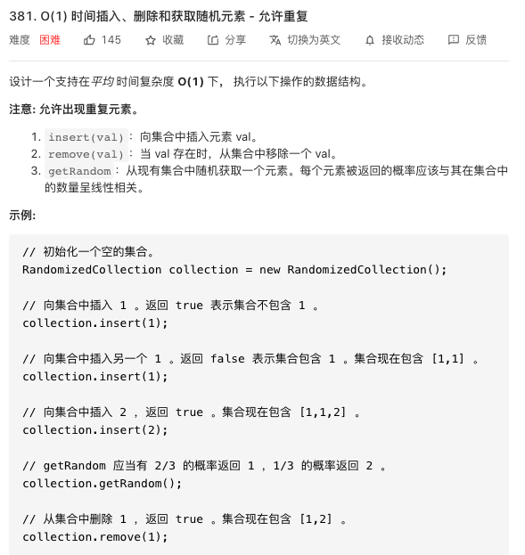
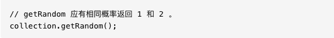
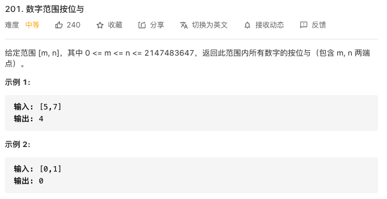
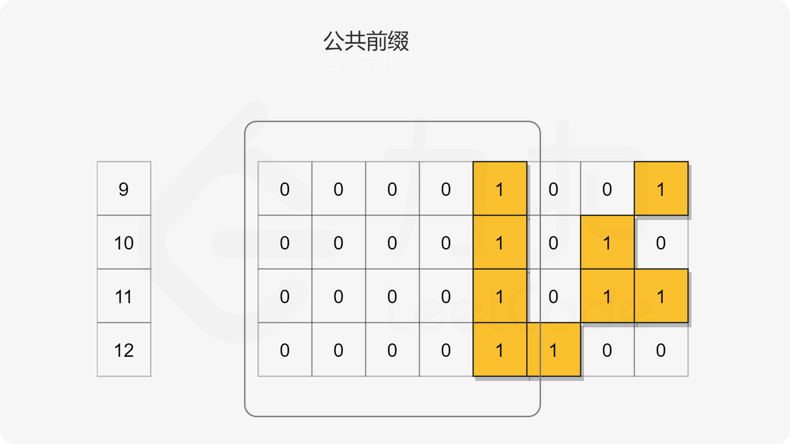
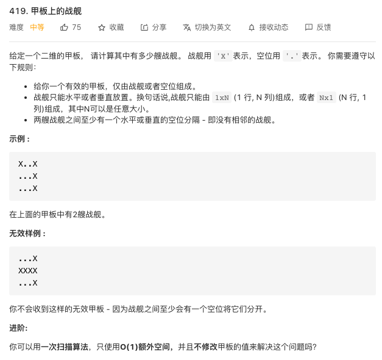
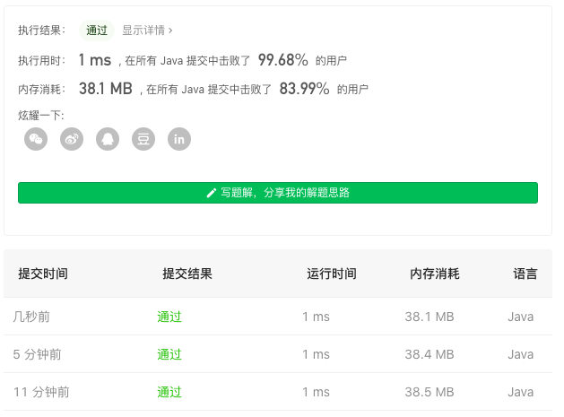

## 力扣练习 1




这个问题的困难之处在于要求平均时间复杂度为 O(1)，而 java 里的数组的操作的时间复杂度为 O(n)。题目没有要求空间复杂度，所以需要考虑用空间换时间。

官方题解：


```java
class RandomizedCollection {
    //记录同一个数出现位置的map
    Map<Integer, Set<Integer>> idx;
    //一个用来储存的列表
    List<Integer> nums;

    //初始化
    public RandomizedCollection() {
        idx = new HashMap<Integer, Set<Integer>>();
        nums = new ArrayList<Integer>();
    }
    //插入
    public boolean insert(int val) {
        //把数插入数组
        nums.add(val);
        //这里用到了getOrDefault，如果这是第一次插入，就为它创建一个新的set
        Set<Integer> set = idx.getOrDefault(val, new HashSet<Integer>());
        //为新插入的元素写入位置信息
        set.add(nums.size() - 1);
        //新的位置信息覆盖旧的
        idx.put(val, set);
        //如果set长度为1，说明是第一次插入
        return set.size() == 1;
    }

    //删除
    public boolean remove(int val) {
        //如果列表里没有这个元素，直接返回 false
        if (!idx.containsKey(val)) {
            return false;
        }
        //把位置信息写入迭代器it
        Iterator<Integer> it = idx.get(val).iterator();
        //读取迭代器
        int i = it.next();
        int lastNum = nums.get(nums.size() - 1);
        //用最后一个元素覆盖需要删除的元素
        nums.set(i, lastNum);
        //删除原来元素所记录的位置信息
        idx.get(val).remove(i);
        //删除最后一个元素原来的位置信息
        idx.get(lastNum).remove(nums.size() - 1);
        //如果不是删除最后一个元素，就为最后一个元素增加新的位置信息
        if (i < nums.size() - 1) {
            idx.get(lastNum).add(i);
        }
        //如果要删除的元素已经没有了，就删除它的位置信息
        if (idx.get(val).size() == 0) {
            idx.remove(val);
        }
        //删除列表里最后一个元素
        nums.remove(nums.size() - 1);
        return true;
    }

    public int getRandom() {
        return nums.get((int) (Math.random() * nums.size()));
    }
}
```

## 力扣练习 2



这个题其实是一个找规律的题，因为最简单的方法就是一位一位去计算嘛，但是这样当计算范围很大的时候计算时间就会很长。观察规律，对于按位与这个操作，只要在这个位上有一个 0，那这一位的结果就是 0。把几位数字的二进制放到一起比较：



会发现相邻的几个数按位与之后，除了公共前缀（前缀一样的部分）外会全部置 0，所以我们的只需要找 n 和 m 的公共前缀，然后补上相应的 0 即可。

### 方法一：位移

n、m 按位右移同时记录右移次数，直到 n 等于 m，此时 n 和 m 就是公共前缀，然后再补回相应的 0

```java
class Solution {
    public int rangeBitwiseAnd(int m, int n) {
        int shift = 0;
        // 找到公共前缀
        while (m < n) {
            m >>= 1;
            n >>= 1;
            ++shift;
        }
        return m << shift;
    }
}
```

### 复杂度分析

- 时间复杂度：O(\log n)O(logn)。算法的时间复杂度取决于 mm 和 nn 的二进制位数，由于 m \le nm≤n，因此时间复杂度取决于 nn 的二进制位数。
- 空间复杂度：O(1)O(1)。我们只需要常数空间存放若干变量。

### 方法二：Brian Kernighan 算法

还有一个位移相关的算法叫做「Brian Kernighan 算法」，它用于清除二进制串中最右边的 1。

Brian Kernighan 算法的关键在于我们每次对 number 和 number−1 之间进行按位与运算后，number 中最右边的 1 会被抹去变成 0。

基于上述技巧，我们可以用它来计算两个二进制字符串的公共前缀。

其思想是，对于给定的范围[m,n](m < n)，我们可以对数字 n 迭代地应用上述技巧，清除最右边的 1，直到它小于或等于 m，此时非公共前缀部分的 1 均被消去。因此最后我们返回 n 即可。

```java
class Solution {
    public int rangeBitwiseAnd(int m, int n) {
        while (m < n) {
            // 抹去最右边的 1
            n = n & (n - 1);
        }
        return n;
    }
}
```

复杂度分析

- 时间复杂度：O(logn)。和位移方法类似，算法的时间复杂度取决于 m 和 n 二进制展开的位数。尽管和位移方法具有相同的渐近复杂度，但 Brian Kernighan 的算法需要的迭代次数会更少，因为它跳过了两个数字之间的所有零位。
- 空间复杂度：O(1)O(1)。我们只需要常数空间存放若干变量。

## 力扣练习 3



计算所有战舰的左上角，其实分析好了思路就很简单了

```java
class Solution {
    public int countBattleships(char[][] board) {
        int sum = 0;
        for (int i = 0;i < board.length;i++){
            for (int j = 0; j < board[i].length;j++) {
                if(board[i][j] == 'X' &&
                        (j == 0 || board[i][j-1] == '.') &&
                        (i == 0 || board[i-1][j] == '.' )){
                        sum++;
                }
            }
        }
        return sum;
    }
}
```


