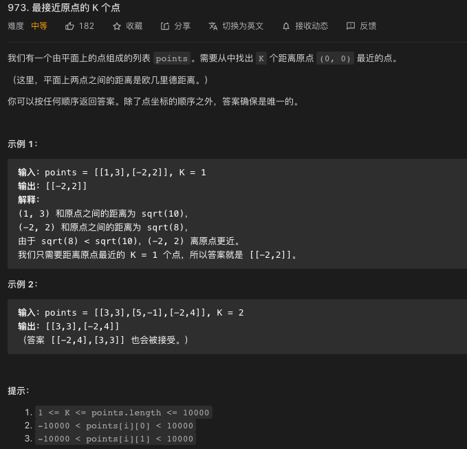
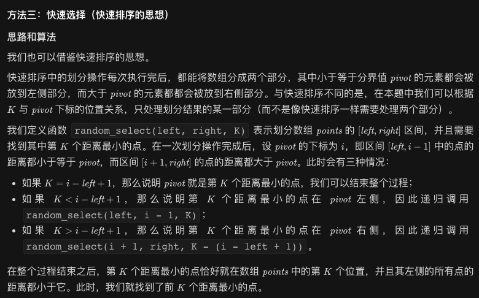

## 力扣973



计算欧几里得距离的平方,为什么是欧几里得距离的「平方」？这是因为欧几里得距离并不一定是个整数，在进行计算和比较时可能会引进误差；但它的平方一定是个整数，这样我们就无需考虑误差了。

### 方法一：排序
思路和算法

将每个点到原点的欧几里得距离的平方从小到大排序后，取出前 $K$ 个即可。

代码

```java

class Solution {
    public int[][] kClosest(int[][] points, int K) {
        Arrays.sort(points, new Comparator<int[]>() {
            public int compare(int[] point1, int[] point2) {
                return (point1[0] * point1[0] + point1[1] * point1[1]) - (point2[0] * point2[0] + point2[1] * point2[1]);
            }
        });
        return Arrays.copyOfRange(points, 0, K);
    }
}
```
复杂度分析

- 时间复杂度：$O(n\log n)$，其中 $n$ 是数组 points 的长度。算法的时间复杂度即排序的时间复杂度。
- 空间复杂度：$O(\log n)$，排序所需额外的空间复杂度为 $O(\log n)$。

### 方法二：优先队列
思路和算法

我们可以使用一个优先队列（大根堆）实时维护前 K 个最小的距离平方。

首先我们将前 K 个点的编号（为了方便最后直接得到答案）以及对应的距离平方放入优先队列中，随后从第 K+1 个点开始遍历：如果当前点的距离平方比堆顶的点的距离平方要小，就把堆顶的点弹出，再插入当前的点。当遍历完成后，所有在优先队列中的点就是前 K 个距离最小的点。

不同的语言提供的优先队列的默认情况不一定相同。在 C++ 语言中，优先队列即为大根堆，但在 Python 语言中，优先队列为小根堆，因此我们需要在优先队列中存储（以及比较）距离平方的相反数。

代码

```java

class Solution {
    public int[][] kClosest(int[][] points, int K) {
        PriorityQueue<int[]> pq = new PriorityQueue<int[]>(new Comparator<int[]>() {
            public int compare(int[] array1, int[] array2) {
                return array2[0] - array1[0];
            }
        });
        for (int i = 0; i < K; ++i) {
            pq.offer(new int[]{points[i][0] * points[i][0] + points[i][1] * points[i][1], i});
        }
        int n = points.length;
        for (int i = K; i < n; ++i) {
            int dist = points[i][0] * points[i][0] + points[i][1] * points[i][1];
            if (dist < pq.peek()[0]) {
                pq.poll();
                pq.offer(new int[]{dist, i});
            }
        }
        int[][] ans = new int[K][2];
        for (int i = 0; i < K; ++i) {
            ans[i] = points[pq.poll()[1]];
        }
        return ans;
    }
}
```
复杂度分析

- 时间复杂度：$O(n\log K)$，其中 n 是数组 points 的长度。由于优先队列维护的是前 K 个距离最小的点，因此弹出和插入操作的单次时间复杂度均为 $O(\log K)$。在最坏情况下，数组里 n 个点都会插入，因此时间复杂度为 $O(n\log K)$。

- 空间复杂度：$O(K)$，因为优先队列中最多有 K 个点。
### 方法三：快速选择（快速排序的思想）


代码
```java
class Solution {
    Random rand = new Random();

    public int[][] kClosest(int[][] points, int K) {
        int n = points.length;
        random_select(points, 0, n - 1, K);
        return Arrays.copyOfRange(points, 0, K);
    }

    public void random_select(int[][] points, int left, int right, int K) {
        int pivotId = left + rand.nextInt(right - left + 1);
        int pivot = points[pivotId][0] * points[pivotId][0] + points[pivotId][1] * points[pivotId][1];
        swap(points, right, pivotId);
        int i = left - 1;
        for (int j = left; j < right; ++j) {
            int dist = points[j][0] * points[j][0] + points[j][1] * points[j][1];
            if (dist <= pivot) {
                ++i;
                swap(points, i, j);
            }
        }
        ++i;
        swap(points, i, right);
        // [left, i-1] 都小于等于 pivot, [i+1, right] 都大于 pivot
        if (K < i - left + 1) {
            random_select(points, left, i - 1, K);
        } else if (K > i - left + 1) {
            random_select(points, i + 1, right, K - (i - left + 1));
        }
    }

    public void swap(int[][] points, int index1, int index2) {
        int[] temp = points[index1];
        points[index1] = points[index2];
        points[index2] = temp;
    }
}
```
复杂度分析

- 时间复杂度：期望为 $O(n)$，其中 n 是数组 points的长度。由于证明过程很繁琐，所以不再这里展开讲。具体证明可以参考《算法导论》第 9 章第 2 小节。
最坏情况下，时间复杂度为 $O(n^2)$。具体地，每次的划分点都是最大值或最小值，一共需要划分 n-1 次，而一次划分需要线性的时间复杂度，所以最坏情况下时间复杂度为 $O(n^2)$。

- 空间复杂度：期望为 $O(\log n)$，即为递归调用的期望深度。
最坏情况下，空间复杂度为 $O(n)$，此时需要划分 n-1 次，对应递归的深度为 n-1 层，所以最坏情况下时间复杂度为 $O(n)$。

然而注意到代码中的递归都是「尾递归」，因此如果编译器支持尾递归优化，那么空间复杂度总为 $O(1)$。即使不支持尾递归优化，我们也可以很方便地将上面的代码改成循环迭代的写法。
