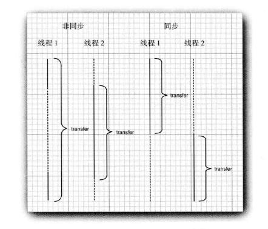

## 同步

在大多数实际的多线程应用中,两个或两个以上的线程需要共享对同一数据的存取。如果两个线程存取相同的对象，并且每一个线程都调用了一个修改该对象状态的方法，将会发生什么呢？可以想象，线程彼此踩了对方的脚。根据各线程访问数据的次序，可能会产生错误的对象。这样一个情况通常称为竞争条件（race condition。)

### 锁对象
有两种机制防止代码块受并发访问的干扰。Java语言提供一个 synchronized 关键字达到这一目的，并且 Java SE 5.0 引入了 ReentrantLock 类。synchronized 关键字自动提供一个锁以及相关的“ 条件”， 对于大多数需要显式锁的情况， 这是很便利的。但是， 我们相信在读者分別阅读了锁和条件的内容之后， 理解 synchronized 关键字是很轻松的事情。java.util.concurrent 框架为这些基础机制提供独立的类，在此以及第 14.5.4 节加以解释这个内容。读者理解了这些构建块之后，将讨论第 14.5.5 节。

用 ReentrantLock 保护代码块的基本结构如下：
```java
myLock.lockO; // a ReentrantLock object
try
{
    critical section
}
finally
{
    myLock.unlock（）；// make sure the lock is unlocked even if an exception is thrown
}
```
```java
public class MyArrayBlockingQueue<T> {

    private final Object[] arr = new Object[5];
    //锁
    private ReentrantLock lock = new ReentrantLock();
    //条件
    private Condition noFull = lock.newCondition();

    private Condition noEmpty = lock.newCondition();

    private int size = 0;

    public void put(T t){
        Object[] temp = arr;
        //加锁
        lock.lock();
        try{
            //容器满了
            while (size == arr.length){
                System.out.println("生产者等待");
                noFull.await();//生成者线程等待
            }
            arr[size++] = t;
            noEmpty.signalAll();//唤醒所有等待的线程
        } catch (InterruptedException e) {
            e.printStackTrace();
        } finally {
            //解锁
            lock.unlock();
        }
    }

    public T get() throws InterruptedException {
        //加锁
        lock.lock();
        try {
            //容器空了
            while (size == 0) {
                System.out.println("消费者等待");
                noEmpty.await();//消费者等待
            }
            Object temp = arr[--size];
            noFull.signalAll();//唤醒所有等待的线程
            return (T)temp;
        } finally {
            //解锁
            lock.unlock();
        }
    }

    public static void main(String[] args) {
        MyArrayBlockingQueue<String> q = new MyArrayBlockingQueue<>();

        //生产者
        new Thread(()->{
            while (true){
                try {
                    Thread.sleep(1000);
                    q.put("口罩");
                    System.out.println("生产者放了一个东西");
                } catch (InterruptedException e) {
                    e.printStackTrace();
                }
            }
        }).start();

        //消费者
        new Thread(()->{
            while (true){
                try {
                    Thread.sleep(1000);
                    System.out.println("消费者取出了"+q.get());
                } catch (InterruptedException e) {
                    e.printStackTrace();
                }
            }
        }).start();
    }
}
```
这一结构确保任何时刻只有一个线程进人临界区。一旦一个线程封锁了锁对象， 其他任何线程都无法通过 lock 语句。当其他线程调用 lock 时，它们被阻塞，直到第一个线程释放锁对象。

假定一个线程调用 transfer, 在执行结束前被剥夺了运行权。假定第二个线程也调用transfer, 由于第二个线程不能获得锁， 将在调用 lock 方法时被阻塞。它必须等待第一个线程完成 transfer 方法的执行之后才能再度被激活。当第一个线程释放锁时，那么第二个线程才能开始运行（见图 14-5。) 图 14-5 非同步线程与同步线程的比较



锁是可重入的， 因为线程可以重复地获得已经持有的锁。锁保持一个持有计数（ holdcount) 来跟踪对 lock 方法的嵌套调用。线程在每一次调用 lock 都要调用 unlock 来释放锁。由于这一特性， 被一个锁保护的代码可以调用另一个使用相同的锁的方法。

Lock 和 Condition 接口为程序设计人员提供了高度的锁定控制。然而，大多数情况下，并不需要那样的控制，并且可以使用一种嵌人到 Java语言内部的机制。从 1.0 版开始，Java中的每一个对象都有一个内部锁。如果一个方法用 synchronized关键字声明，那么对象的锁将保护整个方法。也就是说，要调用该方法，线程必须获得内部的对象锁。 换句话说，
```java
public synchronized void method()
{
    method body
}
```
等价于
```java
public void methodQ
{
    this.intrinsidock.1ock();
    try
    {
        method body
    }
    finally { this.intrinsicLock.unlockO; }
}
```
```java
public class MyArrayBlockingQueue2<T> {

    private final Object[] arr = new Object[5];

    private int size = 0;

    public synchronized void put(T t) throws InterruptedException {
            //容器满了
            while (size == arr.length){
                System.out.println("生产者等待");
                this.wait();//生成者线程等待
            }
            arr[size++] = t;
            this.notifyAll();//唤醒所有等待的线程
    }

    public synchronized T get() throws InterruptedException {
            //容器空了
            while (size == 0) {
                System.out.println("消费者等待");
                this.wait();//消费者等待
            }
            Object temp = arr[--size];
            this.notifyAll();//唤醒所有等待的线程
            return (T)temp;
    }

    public static void main(String[] args) {
        MyArrayBlockingQueue2<String> q = new MyArrayBlockingQueue2<>();

        //生产者
        new Thread(()->{
            while (true){
                try {
                    Thread.sleep(500);
                    q.put("口罩");
                    System.out.println("生产者放了一个东西");
                } catch (InterruptedException e) {
                    e.printStackTrace();
                }
            }
        }).start();

        //消费者
        new Thread(()->{
            while (true){
                try {
                    Thread.sleep(1000);
                    System.out.println("消费者取出了"+q.get());
                } catch (InterruptedException e) {
                    e.printStackTrace();
                }
            }
        }).start();
    }
}

```
例如， 可以简单地声明 Bank 类的 transfer 方法为 synchronized, 而不是使用一个显式的锁。内部对象锁只有一个相关条件。wait 方法添加一个线程到等待集中，notifyAU /notify方法解除等待线程的阻塞状态。

在代码中应该使用哪一种？ Lock 和 Condition 对象还是同步方法？下面是一些建议：

- 最好既不使用 Lock/Condition 也不使用 synchronized 关键字。在许多情况下你可以使用 java.util.concurrent 包中的一种机制，它会为你处理所有的加锁。例如， 在 14.6 节，你会看到如何使用阻塞队列来同步完成一个共同任务的线程。还应当研究一下并行流，有关内容参见卷 n 第 1 章。
- 如果 synchronized 关键字适合你的程序， 那么请尽量使用它，这样可以减少编写的代码数量，减少出错的几率。程序清单 14-8 给出了用同步方法实现的银行实例。
- 如果特别需要 Lock/Condition 结构提供的独有特性时，才使用 Lock/Condition。

## 线程池
```java
public class Threadpoo {
    public static void main(String[] args) throws ExecutionException, InterruptedException {
        //缓存线程池 重复线程池
        ExecutorService pool1 = Executors.newCachedThreadPool();
        //固定数量线程池
        ExecutorService pool2 = Executors.newFixedThreadPool(10);
        //单线程线程池
        ExecutorService pool3 = Executors.newSingleThreadExecutor();
        //未来计划线程池
        ExecutorService pool4 = Executors.newScheduledThreadPool(10);

//        new ThreadPoolExecutor(5,//corePoolSize 核心线程数 默认情况下 即使空闲，也不会被回收
//                10,//maximumPoolSize总线程数 核心+非核心 非核心一旦空闲就会回收
//                10,//keepAliveTime空闲线程存活时间
//                TimeUnit.SECONDS,//unit时间单位
//                new LinkedBlockingQueue<>(),//workQueue任务队列 用来排队
//                new ThreadFactory() {
//                    @Override
//                    public Thread newThread(Runnable r) {
//                        return null;
//                    }
//                },//threadFactory创建线程的工厂
//                1//handler拒绝策略 丢弃新任务并抛出异常
//        );

        //常用的5个参数的写法
        ExecutorService pool = new ThreadPoolExecutor(3,3,10,
                TimeUnit.SECONDS,new LinkedBlockingQueue<>());

        Runnable r = new Runnable() {
            @Override
            public void run() {

            }
        };

        Callable c = new Callable() {
            @Override
            public Object call() throws Exception {
                return null;
            }
        };

        pool.execute(r);//交给线程池去管理去执行
        Future<Integer> fu = pool.submit(c);
        Integer in = fu.get();//阻塞

        pool.shutdown();//记得关掉
    }
}
```
线程池的简单用法

```java
public class TestPool2 {
    public static void main(String[] args) throws InterruptedException {
        ExecutorService pool = Executors.newFixedThreadPool(10);
        for (int i = 0; i < 10; i++) {
            pool.execute(()->{
                for (int j = 0; j < 5; j++) {
                    System.out.println(Thread.currentThread()+"-"+j);
                }
            });
        }

        pool.shutdown();
        
    }
}
```