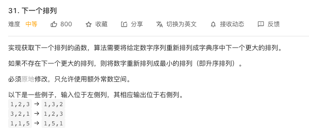

## 力扣31



一开始还是有点蒙蔽的，不过试了几个测试用例之后还是慢慢弄明白了，就是要从后往前找，找到第一个nums[i]满足 nums[i] < nums[i+1]的数，然后在i+1到n里找一个最小的比nums[i]大的数，然后和它交互，然后把剩下的数升序排列。我还用了快排，看了题解之后相到，其实原来的数组已经满足了降序排列了，只要交换一下就好了，不需要特地排序。

这是我第一次写的
```java
class Solution {
    public void nextPermutation(int[] nums) {
        int i;
        for (i = nums.length-1; i > 0 ; i--) {
            if(nums[i] > nums[i-1]){
                break;
            }
        }
        if(i != 0){
            int min = i;
            int l = nums[i] - nums[i-1];
            for(int j = i;j<nums.length;j++){
                if((nums[j] - nums[i-1]) > 0 && (nums[j] - nums[i-1]) < l){
                   min = j;
                   l = nums[j] - nums[i-1];
                }
            }
            int item = nums[i-1];
            nums[i-1] = nums[min];
            nums[min] = item;
            quick_sort(nums,i,nums.length-1);
        }else {
            for(int j = 0,k = nums.length-1;j < k;j++,k--){
                int item = nums[j];
                nums[j] = nums[k];
                nums[k] = item;
            }
        }
    }

    public static void quick_sort(int s[], int l, int r)
    {
        if (l < r)
        {
            int i = l, j = r, x = s[l];
            while (i < j)
            {
                while(i < j && s[j] >= x) // 从右向左找第一个小于x的数
                    j--;
                if(i < j)
                    s[i++] = s[j];

                while(i < j && s[i] < x) // 从左向右找第一个大于等于x的数
                    i++;
                if(i < j)
                    s[j--] = s[i];
            }
            s[i] = x;
            quick_sort(s, l, i - 1); // 递归调用
            quick_sort(s, i + 1, r);
        }
    }
}
```
结果：


看了题解之后优化版本：
```java
class Solution {
    public void nextPermutation(int[] nums) {
        int i = nums.length-1;
        while (i > 0 && nums[i] <= nums[i-1]) {
            i--;
        }
        if(i != 0) {
            int j = nums.length-1;
            while (j >= 0 && nums[i-1] >= nums[j]){
                j--;
            }
            exchange(nums, i - 1, j);
        }
        for(int j = i,k = nums.length-1;j < k;j++,k--){
            exchange(nums,j,k);
        }
    }

    public static void exchange(int[] arr,int j ,int k){
        int item = arr[j];
        arr[j] = arr[k];
        arr[k] = item;
    }
}
```
结果：
