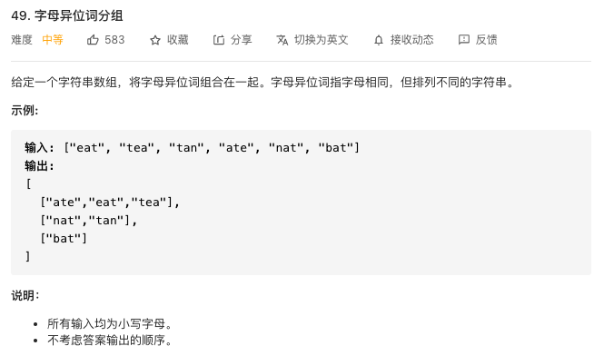
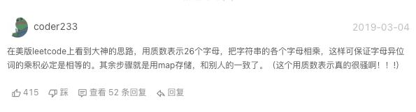

## 力扣49

 

 我想的是将数组变为列表（这样就可以删除了），然后列表里的每一个和后面的比较，比较的方法是先排序再比较字符串。如果相等就把该字符串从原列表中删除，直到原列表中没有元素。但这样时间复杂度依然有点高，在运行一个特别长的例子时超时了
 ```java
 public class Ex49 {
    public List<List<String>> groupAnagrams(String[] strs) {
        if(strs==null){
            return null;
        }
        List<String> list = new ArrayList<>();
        List<List<String>> lists = new ArrayList<>();
        Collections.addAll(list,strs);
        while (!list.isEmpty()){
            String str = list.get(0);
            List<String> list1 = new ArrayList<>();
            list1.add(str);
            list.remove(str);
            Iterator<String> iterator = list.iterator();
            while (iterator.hasNext()){
                String string = iterator.next();
                if(is(string,str)){
                    list1.add(string);
                    iterator.remove();
                }
            }
            lists.add(list1);
        }
        return lists;
    }

    //比较两个字符串是否字母相同
    public static boolean is(String str1,String str2){
        char[] char1 = str1.toCharArray();
        char[] char2 = str2.toCharArray();
        Arrays.sort(char1);
        Arrays.sort(char2);
        str1 = String.valueOf(char1);
        str2 = String.valueOf(char2);
        return str1.equals(str2);
    }

    public static void main(String[] args) {
        String[] strs = new String[]{"eat", "tea", "tan", "ate", "nat", "bat"};
        
        List<List<String>> list = new Ex49().groupAnagrams(strs);
        System.out.println(list);
    }
}
```

！[img](../img/力扣49_2.png)

官方的方法是放到hashMap里面，保证没有重复。用到了Map.getOrDefault()方法
```java
default V getOrDefault(Object key, V defaultValue) {
        V v;
        return (((v = get(key)) != null) || containsKey(key))
            ? v
            : defaultValue;
    }
```
意思就是当Map集合中有这个key时，就使用这个key值，如果没有就使用默认值defaultValue
官方的参考代码：
```java
 public List<List<String>> groupAnagrams(String[] strs) {
       Map<String, List<String>> map = new HashMap<String, List<String>>();
        for (String str : strs) {
            char[] array = str.toCharArray();
            Arrays.sort(array);
            String key = new String(array);
            List<String> list = map.getOrDefault(key, new ArrayList<String>());
            list.add(str);
            map.put(key, list);
        }
        return new ArrayList<List<String>>(map.values());
    }
```

另外评论区有一种很有意思的算法：用26个不同的质数表示26个字母，这样不同的字母排列组合的质数相乘的结果会不一样




