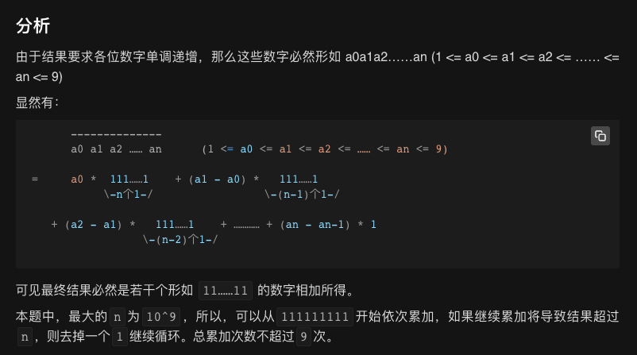

## 力扣 738


思考了一会就做出来了，时间意外的好

```java
class Solution {
    public int monotoneIncreasingDigits(int N) {
        if(N<10){
            return N;
        }
        List<Integer> a = arr(N);
        int n = 0;
        int j = a.size()-1;
        int i = j-1;
        while (i>=0){
            if(a.get(j)<a.get(i)){
                for (int k = 0; k < j - i; k++) {
                    n = a.get(j) + n*10;
                }
                j=i;
                i--;
            }else {
                if(a.get(j)==a.get(i)){
                    i--;
                }else {
                    n = a.get(j)-1 + n*10;
                    j--;
                    for (int k = 0;k<=j;k++){
                        n = 9 + n*10;
                    }
                    return n;
                }
            }
        }
        return N;
    }
    public static List<Integer> arr(int N){
        List<Integer> a = new ArrayList<>();
        while (N>=10){
            a.add(N%10);
            N = N/10;
        }
        a.add(N);
        return a;
    }
}
```


题解区看到的一个特别的解法，依次用 111111111 去累加，如果结果大于 N 则去掉一位 1，9 次即可得到结果



```java
class Solution {
    public int monotoneIncreasingDigits(int N) {
        int ones = 111111111;
        int res = 0;
        for(int i=0;i<9;i++){
            while(res+ones>N){
                ones/=10;
            }
            res += ones;
            if(ones==0)
            break;
        }
        return res;
    }
}
```
